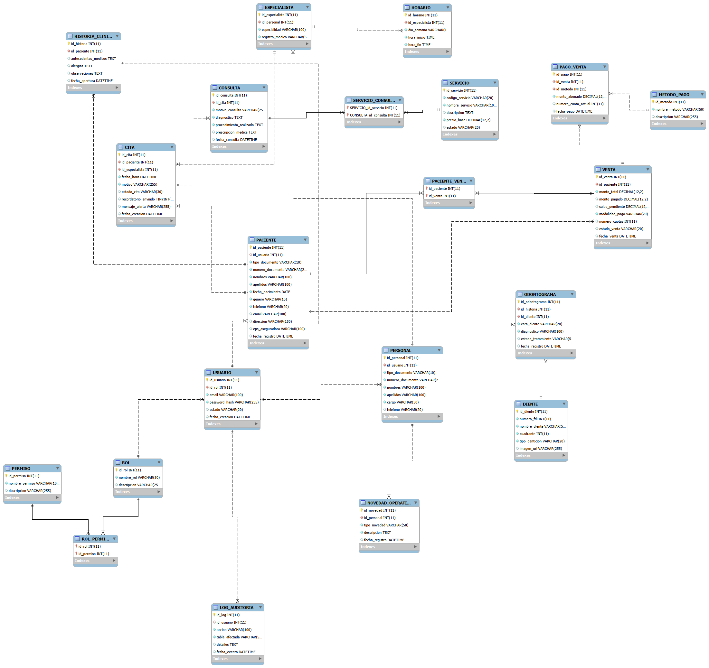

# DentalCare BD - Sistema de Gestión Odontológica

Este repositorio contiene la arquitectura, modelo relacional, scripts de base de datos y documentación técnica para el proyecto **DentalCare BD**, un sistema de información diseñado para la gestión integral de una clínica odontológica.

Tecnologías Utilizadas
SGBD: MySQL 8.0+

Herramientas de Diseño y Administración: MySQL Workbench, phpMyAdmin

Modelado: StarUML / Diagramación ER

Control de Versiones: Git y GitHub

dentalcare_bd/
│
├── database/
│   └── dentalcare_bd.sql       # Script completo con DDL (tablas) y DML (poblamiento)
│
├── docs/
│   ├── README.md               # Documentación adicional
│   └── diagrama_er.png         # Diagrama Entidad-Relación de la base de datos
│
└── README.md                   # Documentación principal del proyecto

Descripción del Modelo Relacional
La base de datos se encuentra totalmente normalizada hasta la Tercera Forma Normal (3FN) y cubre los siguientes módulos funcionales:

Gestión de Usuarios y Roles: Control de acceso e identidades en el sistema.

Pacientes e Historias Clínicas: Registro detallado de antecedentes médicos, alergias y evolución del paciente.

Citas y Agenda: Programación y seguimiento de la disponibilidad odontológica.

Tratamientos y Procedimientos: Catálogo de servicios odontológicos brindados.

Facturación y Pagos: Registro financiero de procedimientos y transacciones.

Novedades Operativas: Reporte de mantenimiento e incidentes en equipos de la clínica.

Instrucciones de Instalación e Importación
Para montar y desplegar la base de datos en tu entorno local:

Clonar el repositorio: `git clone https://github.com/jeidy94-git/dentalcare_bd.git` 

Importar la base de datos:

Vía MySQL CLI: mysql -u tu_usuario -p < database/dentalcare_bd.sql
Vía phpMyAdmin / MySQL Workbench:

Crea la base de datos ejecutando CREATE DATABASE dentalcare_bd;.

Selecciona la base de datos y usa la opción Importar / Run SQL Script.

Selecciona el archivo database/dentalcare_bd.sql.

Diagrama Entidad-Relación (ER)
Puedes consultar el diagrama gráfico del modelo relacional en la carpeta docs/ o visualizarlo a continuación:

✒️ Autora
Jeidy - jeidy94-git
